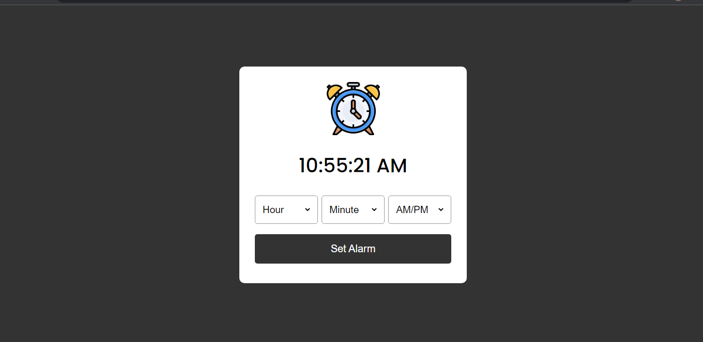

# Alarm Clock project

This is a replica of Coding Nepal Alarm clock project with a little tweak.

## Table of contents

- [Overview](#overview)
  - [The challenge](#the-challenge)
  - [Screenshot](#screenshot)
  - [Links](#links)
  - [Built with](#built-with)
- [Author](#author)

## Overview

A simple Alarm Clock

### The challenge

Users should be able to:

- View the optimal layout for the site depending on their device's screen size
- See hover states for all interactive elements on the page
- See the current time displayed on the uppermost part of the page.
- Select the time to be used for alarm
- Set Alarm by clicking the "Set Alarm" button
- On setting the alarm, the time options are disabled
- Get an alarm beep when it is time
- After setting the alarm, the inner text of the button changes to Clear Alarm.
- On clicking the clear alarm button, the disability of the time option is removed, the alarm beep is paused and the inner text of the button changes back to "Set Alarm"

### Screenshot

### Links

- Solution URL: [Git repo url](https://github.com/Plut0r/Alarm-clock)
- Live Site URL: [Git live url]()

### Built with

- Semantic HTML5 markup
- CSS custom properties
- Flexbox
- Javascript

## Author

- Frontend Mentor - [@Plut0r](https://www.frontendmentor.io/profile/Plut0r)
- Linkedin - [@Plutor](https://www.linkedin.com/in/plut0r)
